# Class Diagram

The diagram below shows every class, interface, enum and exception in `src/`
(the test classes in `test/` are left out to keep it readable).

Visibility markers: `+` public, `-` private, `#` protected.
A `*` after a method means it is abstract; a `$` means it is static.
Getters and setters that simply read or write one field are partly left out where they add nothing new.

```mermaid
classDiagram
    direction TB

    %% ---------------- model: devices ----------------
    class Device {
        <<abstract>>
        +double MAX_RATING_WATTS$
        +String TABLE_HEADER$
        -String id
        -String name
        -boolean isOn
        -double powerRatingWatts
        #Device(String idPrefix, String name, double powerRatingWatts)
        #Device(String existingId, String name, boolean isOn, double powerRatingWatts)
        +getId() String
        +getName() String
        +setName(String name) void
        +isOn() boolean
        +getPowerRatingWatts() double
        +setPowerRatingWatts(double powerRatingWatts) void
        +turnOn() void
        +turnOff() void
        +toggle() void
        +getDeviceType()* String
        +getStatus()* String
        +getCurrentPowerWatts()* double
        +toFileString()* String
        #baseFileString() String
        +toString() String
    }

    class Adjustable {
        <<interface>>
        +setLevel(int level) void
        +getLevel() int
        +getMinLevel() int
        +getMaxLevel() int
        +getLevelName() String
    }

    class Light {
        +String ID_PREFIX$
        +double DEFAULT_RATING$
        -String[] COLOURS$
        -int brightness
        -String colour
        +Light(String name)
        +Light(String name, double rating, int brightness, String colour)
        +Light(String id, String name, boolean isOn, double rating, int brightness, String colour)
        +getColourOptions()$ String[]
        +getBrightness() int
        +setBrightness(int brightness) void
        +getColour() String
        +setColour(String colour) void
        +setLevel(int level) void
        +getCurrentPowerWatts() double
        +toFileString() String
    }

    class Fan {
        +String ID_PREFIX$
        +double DEFAULT_RATING$
        -int speed
        +Fan(String name)
        +Fan(String name, double rating, int speed)
        +Fan(String id, String name, boolean isOn, double rating, int speed)
        +getSpeed() int
        +setSpeed(int speed) void
        +setLevel(int level) void
        +getCurrentPowerWatts() double
        +toFileString() String
    }

    class AirConditioner {
        +String ID_PREFIX$
        +String MODE_COOL$
        +String MODE_DRY$
        +String MODE_FAN$
        -String[] MODES$
        -int temperature
        -String mode
        +AirConditioner(String name)
        +AirConditioner(String name, double rating, int temperature, String mode)
        +AirConditioner(String id, String name, boolean isOn, double rating, int temperature, String mode)
        +getModeOptions()$ String[]
        +getTemperature() int
        +setTemperature(int temperature) void
        +getMode() String
        +setMode(String mode) void
        +setLevel(int level) void
        +getCurrentPowerWatts() double
        +toFileString() String
    }

    class SmartTV {
        +String ID_PREFIX$
        -int volume
        -int channel
        +SmartTV(String name)
        +SmartTV(String name, double rating, int volume, int channel)
        +SmartTV(String id, String name, boolean isOn, double rating, int volume, int channel)
        +getVolume() int
        +setVolume(int volume) void
        +getChannel() int
        +setChannel(int channel) void
        +setLevel(int level) void
        +getCurrentPowerWatts() double
        +toFileString() String
    }

    class DoorLock {
        <<final>>
        +String ID_PREFIX$
        +int MAX_ATTEMPTS$
        -boolean locked
        -int pin
        -int failedAttempts
        -boolean keypadLocked
        +DoorLock(String name)
        +DoorLock(String name, double rating, int pin)
        +DoorLock(String id, String name, boolean isOn, double rating, boolean locked, int pin)
        +isLocked() boolean
        +isKeypadLocked() boolean
        +getRemainingAttempts() int
        +lock() void
        +unlock(int enteredPin) boolean
        +changePin(int oldPin, int newPin) void
        +turnOff() void
        +getCurrentPowerWatts() double
        +toFileString() String
        -recordFailedAttempt() void
    }

    %% ---------------- model: containers ----------------
    class Room {
        +int MAX_DEVICES$
        -String name
        -Device[] devices
        -int deviceCount
        +Room(String name)
        +getName() String
        +setName(String name) void
        +addDevice(Device d) void
        +removeDevice(String id) Device
        +findDevice(String id) Device
        +findDevice(int index) Device
        +getDevices() Device[]
        +getDeviceCount() int
        +getTotalPowerWatts() double
        +turnAllOff() void
        -indexOf(String id) int
    }

    class Home {
        +int MAX_ROOMS$
        +int MAX_SCENES$
        -String name
        -Room[] rooms
        -int roomCount
        -Scene[] scenes
        -int sceneCount
        +Home(String name)
        +addRoom(Room r) void
        +removeRoom(String roomName) Room
        +findRoom(String roomName) Room
        +renameRoom(String oldName, String newName) void
        +getRooms() Room[]
        +findDeviceAnywhere(String id) Device
        +findRoomOfDevice(String id) Room
        +getTotalDeviceCount() int
        +getOnDeviceCount() int
        +getTotalPowerWatts() double
        +addScene(Scene s) void
        +findScene(String sceneName) Scene
        +removeScene(String sceneName) Scene
        +getScenes() Scene[]
    }

    class Scene {
        +int MAX_ACTIONS$
        -String name
        -SceneAction[] actions
        -int actionCount
        -int lastSuccessCount
        +Scene(String name)
        +addAction(SceneAction a) void
        +removeAction(int index) SceneAction
        +getActions() SceneAction[]
        +getActionCount() int
        +getLastSuccessCount() int
        +run(Home home) String
    }

    class SceneAction {
        -String deviceId
        -ActionType type
        -int value
        +SceneAction(String deviceId, ActionType type, int value)
        +execute(Device d) String
        +describe() String
        +toFileString() String
    }

    class ActionType {
        <<enumeration>>
        TURN_ON
        TURN_OFF
        TOGGLE
        SET_LEVEL
        LOCK
    }

    %% ---------------- services ----------------
    class EnergyCalculator {
        +double DEFAULT_RATE_PER_KWH$
        +int DAYS_PER_MONTH$
        -double ratePerKwh
        +EnergyCalculator()
        +EnergyCalculator(double ratePerKwh)
        +setRatePerKwh(double ratePerKwh) void
        +calculateKwh(Device d, double hours) double
        +calculateKwh(Room r, double hours) double
        +calculateKwh(Home h, double hours) double
        +calculateCost(double kwh) double
        +calculateCost(double kwh, double ratePerKwh) double
        +monthlyKwh(Home h, double hoursPerDay) double
        +calculateSlabBill(double units) double
    }

    class FileManager {
        +String DEFAULT_DIRECTORY$
        -File directory
        +FileManager()
        +FileManager(String baseDirectory)
        +saveHome(Home h) void
        +saveScenes(Home h) void
        +loadHome() Home
        +loadScenes(Home h) void
        +appendLog(String category, String message) void
        +readLastLogLines(int n) String[]
        -parseDevice(String[] f, Home home) Device
    }

    class DemoData {
        <<utility>>
        +buildDemoHome()$ Home
    }

    %% ---------------- util ----------------
    class IdGenerator {
        <<utility>>
        -String[] PREFIXES$
        -int[] COUNTERS$
        +nextId(String prefix)$ String
        +registerExisting(String id)$ void
        +prefixOf(String id)$ String
        +reset()$ void
    }

    class InputHelper {
        <<utility>>
        +int MAX_NAME_LENGTH$
        -Scanner SCANNER$
        +validateName(String name)$ String
        +readInt(String prompt, int min, int max)$ int
        +readOptionalInt(String prompt, int min, int max, int defaultValue)$ int
        +readDouble(String prompt, double min, double max)$ double
        +readOptionalDouble(String prompt, double min, double max, double defaultValue)$ double
        +readName(String prompt)$ String
        +readId(String prompt)$ String
        +readYesNo(String prompt)$ boolean
        +pause()$ void
    }

    class InputClosedException {
        <<nested in InputHelper>>
    }

    class Main {
        -Home home$
        -FileManager fileManager$
        -EnergyCalculator energyCalculator$
        +main(String[] args)$ void
        -runMainMenu()$ void
        -showDashboard()$ void
        -manageRooms()$ void
        -manageDevices()$ void
        -controlDevice()$ void
        -manageScenes()$ void
        -energyReport()$ void
        -showLog()$ void
    }

    %% ---------------- exceptions ----------------
    class Exception
    class RuntimeException
    class DeviceNotFoundException {
        +DeviceNotFoundException(String message)
    }
    class CapacityExceededException {
        +CapacityExceededException(String message)
    }
    class InvalidInputException {
        +InvalidInputException(String message)
    }

    %% ---------------- inheritance ----------------
    Device <|-- Light
    Device <|-- Fan
    Device <|-- AirConditioner
    Device <|-- SmartTV
    Device <|-- DoorLock
    Exception <|-- DeviceNotFoundException
    Exception <|-- CapacityExceededException
    Exception <|-- InvalidInputException
    RuntimeException <|-- InputClosedException

    %% ---------------- interface implementation ----------------
    Adjustable <|.. Light
    Adjustable <|.. Fan
    Adjustable <|.. AirConditioner
    Adjustable <|.. SmartTV

    %% ---------------- composition ----------------
    Home "1" *-- "1..8" Room : rooms
    Home "1" *-- "0..10" Scene : scenes
    Room "1" *-- "0..10" Device : devices
    Scene "1" *-- "1..15" SceneAction : actions
    SceneAction --> ActionType : type

    %% ---------------- dependencies ----------------
    Main ..> Home : manages
    Main ..> FileManager : uses
    Main ..> EnergyCalculator : uses
    Main ..> DemoData : uses
    Main ..> InputHelper : reads input
    EnergyCalculator ..> Device : reads power
    EnergyCalculator ..> Room : reads power
    EnergyCalculator ..> Home : reads power
    FileManager ..> Home : saves / loads
    FileManager ..> Device : creates
    FileManager ..> Scene : saves / loads
    DemoData ..> Home : builds
    SceneAction ..> Device : executes on
    SceneAction ..> Adjustable : casts to
    Device ..> IdGenerator : gets IDs
    InputHelper ..> InputClosedException : throws
    Room ..> DeviceNotFoundException : throws
    Room ..> CapacityExceededException : throws
    Device ..> InvalidInputException : throws
```



## Reading the diagram

| Arrow | Meaning | Example |
|---|---|---|
| `<\|--` solid line, hollow triangle | inheritance (`extends`) | `Light` extends `Device` |
| `<\|..` dotted line, hollow triangle | interface implementation (`implements`) | `Fan` implements `Adjustable` |
| `*--` filled diamond | composition: the part lives inside the whole | a `Room` holds 0..10 `Device` objects |
| `-->` solid arrow | association: one class keeps a reference to another | a `SceneAction` stores an `ActionType` |
| `..>` dotted arrow | dependency: one class uses another inside a method | `EnergyCalculator` reads a `Home`'s power |

The multiplicities on the composition lines are the array capacities:
`Home.MAX_ROOMS = 8`, `Home.MAX_SCENES = 10`, `Room.MAX_DEVICES = 10`
and `Scene.MAX_ACTIONS = 15`. A home is shown with 1..8 rooms because a
useful home has at least one room (the program can briefly have 0 while you
are setting up an empty home). A scene always has at least one step, because
the scene editor refuses to save an empty scene.

## Exporting the diagram as an image

1. Open <https://mermaid.live> in a browser.
2. Delete the sample code in the left-hand editor.
3. Copy everything between the ` ```mermaid ` and ` ``` ` lines above and paste it in.
4. Use **Actions → PNG** (or **SVG**) to download the picture for your report or slides.

GitHub, GitLab and VS Code (with a Mermaid preview extension) also draw the diagram
directly when you open this file.
